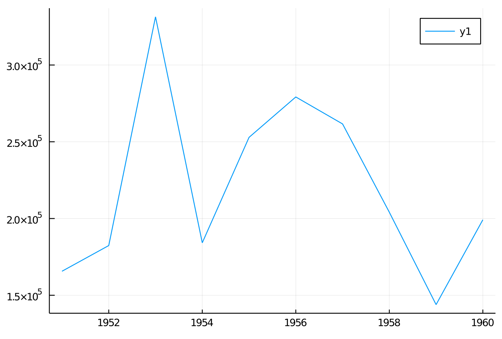

# Streiks

> AB1

## Niederschlagung

Die Niederschlagung der Aufstände wurde dardurch begründet, dass Imperialistische Mächte Leute eingeschleust haben, die dann einen Putsch vollziehen wollte.

## Wahrheitsgehalt

Wie man sehen kann sind die Aufstände weitreichender und Großflächiger als angegeben. Sie Konzentrierten sich ausserdem nicht auf Berlin.

## Propaganda

Freund-Feindbild -> Sodass diese Leute als Feind angesehen werden.

## Legitimität

Zeigt das es nicht Demokratisch ist da es keine Freienwahlen gibt.

## Mauerbau

| Anzahl | Alter | Geschlecht | Beruf              | Stand                   | persönlich-familiär                   | politisch                      | wirtschaftliche                             |
| ------ | ----- | ---------- | ------------------ | ----------------------- | ------------------------------------- | ------------------------------ | ------------------------------------------- |
| 2      | 31    | Man/Frau   | wiss. Assistent    | Verheiratet             |                                       | keine Marxisten                | angst vor Job verlust                       |
| 1      | 20    | Frau       | Film/Photo         | ledig, Vater tot Bruder |                                       | Propaganda opp.                | Benachteiligung von nacht Parteimitgliedern |
| 1      | 35    | Mann       | Traktorist         | verheiratet             | glauben                               | gruppen zwang                  | lebensmittel Knappheit                      |
| 1      | 24    | Mann       | Maschinenschlosser |                         | beschwerde Freiheit, keine Opposition |                                |
| 1      | 35    | Frau       | Weichenreinigung   | Verheiratet 2 Kinder    | Kinder bereits in der BRD             | nicht mit System einverstanden |                                             |

## D

Vermehrt Jüngere, Gut ausgebildete, vereinzelt Familien. Vermehrt aus politische Gründen. Geschlechtsunabhängig.

## Auswertung Flüchtlinge

Es gab ein Ausbruch der Flüchtigen bei 1953 grund dafür war wahrscheinlich der Aufstand des 17 Junis. Einbruch bei 1959.

## M3

Fühlen sich in Gefangenschaft und somit werden die Menschen unglücklich.
Dabei behauptet die Staatsführung, dass es sich hier um ein Paradies handelt

## M2 Satz 1

Er sagt das die Propaganda bei den meisten nicht Funktioniert.

## M4

Er will die Region stabilisieren, dass er sie als Bollwerk gegen den Kapitalismus einsetzen kann.

## M5

Die Antwort hat nichts mit der Frage zu tun. Bei der Frage nach der Staatsgrenze ist hier offensichtlich ein Grenzposten gemeint. Herr Pike antworted jedoch mit etwas völlig anderem und nicht relativiertem. Er lügt also offensichtlich.

## M6

In oberen Bild Sitzt ein dicker Man auf dem Brandenburger Tor mit einer auf die dem Betrachter zugewannte Seite gerichtet AK in der Hand. Dabei ist das Tor mit einem Gitter verschlossen.
Auf dem unteren Bild Steht ein freundlicher junger Mann hinter dem offenen Brandenburger Tor er trägt eine Waffe geschultert auf dem Rücken. Der Man im oberen Bild soll dabei den Ostblock darstellen, dies sieht man an der AK sowie seinem Totalen abschottungsverhalten (Eisernenvorhang). Wobei der untere Mann die "Freundlichen" Westalliierten darstellen soll, zusehen an der gesenkten Waffe und der nicht Abschottung

## M7

ironisch und spöttisch. Kritick an der Zurückhaltung

## Aufgaben

Spionage, Gegenspionage, Unterdrückung Oppositioneller, Klassenkampf

1.100 1950
10.000 1953
20.000 1961

## Rechtstaat was ist das

Humanist so würde ich einen humanen Henker bezeichnen. Denn hinrichtungen sind Käse. Also ich mag Käse. Gerichtsurteil, oder wie mann es bei uns sagt schriftliche Empfehlung. Also ich empfehle immer Käse. Mitglieder des Volkes die unseren Volksschutzstreifenpassieren sollen gefälligst.
