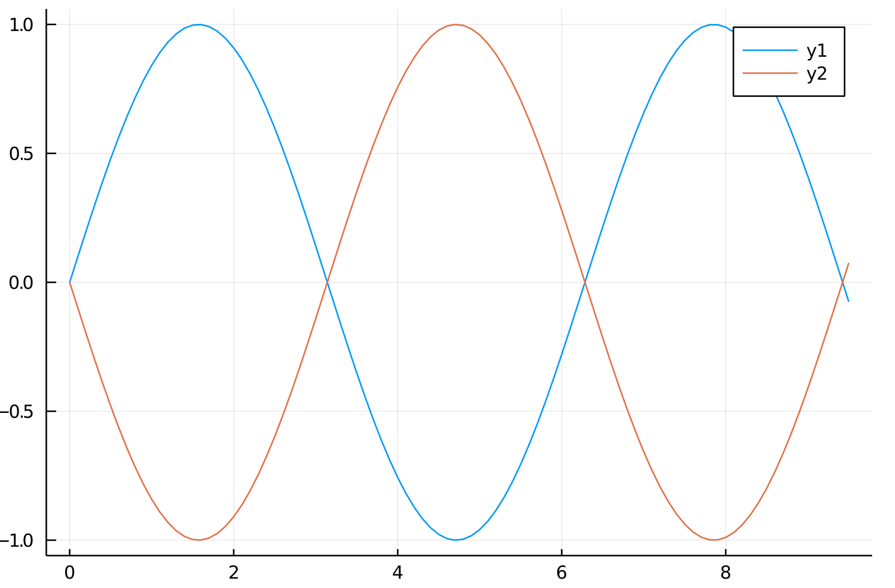

# Stehende Wellen

## Monochord

s=1m
$f_0=440hz$

Ges: `c`

Grundbedingung: Zwei feste Enden. -> $f = k \cdot \dfrac{c}{2s}$

$c = \dfrac{f\cdot2s}{k}$ Grundschwingung -> k = 1

$c = f\cdot2s$ -> $c = 440hz \cdot 2 \cdot 1m = 880\dfrac{m}{s}$

$f_2= k \cdot f_0$ -> k = 3 $f_2 = 1320hz$

## Aufgabe 2

Gültigkeit: Ungleiche enden

$f_n = (2 \cdot n - 1) \dfrac{c}{4s}$

$s = 3.6m$

$f_2 = (2 \cdot 2 - 1) \dfrac{c}{4s} = 3\dfrac{c}{4s} = 1hz$

$f_1 = \dfrac{1}{3}hz = \dfrac{c}{4s}$ -> $f_k = (2 \cdot n - 1) \dfrac{1}{3}hz$

##
