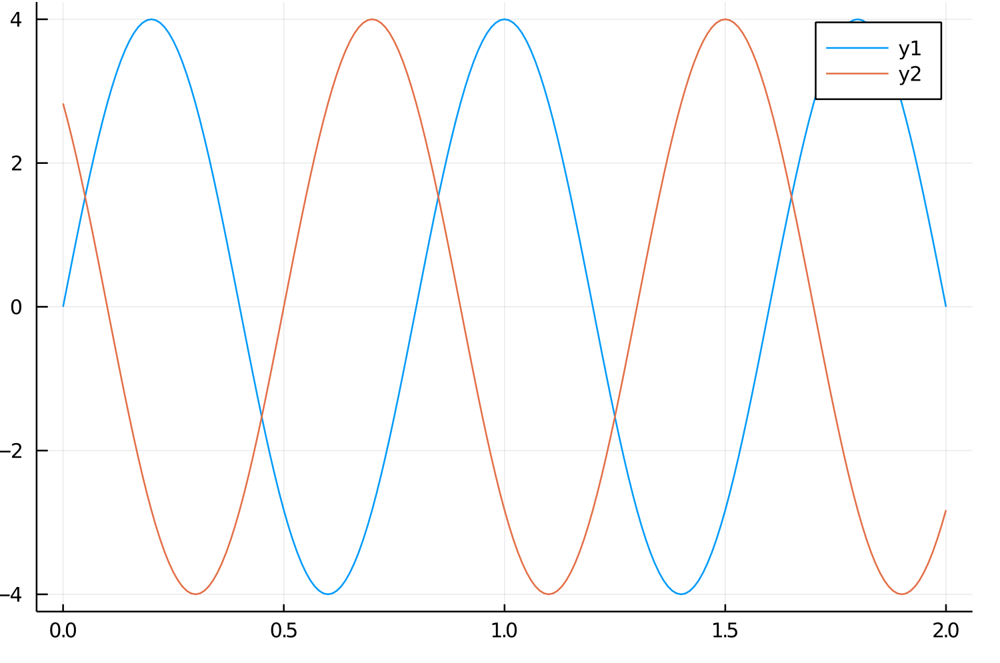

# Wellen - AB1

## Bestimmen der Größen durch Bilder

$c = \dfrac{\Delta s}{\Delta t}$

$c = 50 \dfrac{cm}{s}$

$\hat{y} = 4cm$

Wellenlänge $\lambda = 40cm$

$\dfrac{\lambda}{c} = T$

$T = 0.8s$ -> $f = \frac{1}{0.8s} = 1.25hz$

$\omega = 2\pi \cdot f \approx 7.854hz$

## Skizzieren sie die Zeit-Elongationsfunktion

$y_0(t) = 4cm \sin(\dfrac{2\pi}{0.8}t)$

Phasenverschiebung: $c_{12} = \dfrac{12}{40}$

$y_{12}(t) = 4cm \sin(\dfrac{2\pi}{0.8}(t + \dfrac{12}{40}))$

## Phasen

T12 ist verschoben zu T0 um $\dfrac{12}{40}$ und ist somit nicht in phase. T40 ist verschoben zu T0 um 1 und ist somit in phase ab dem 9ten Bild.
