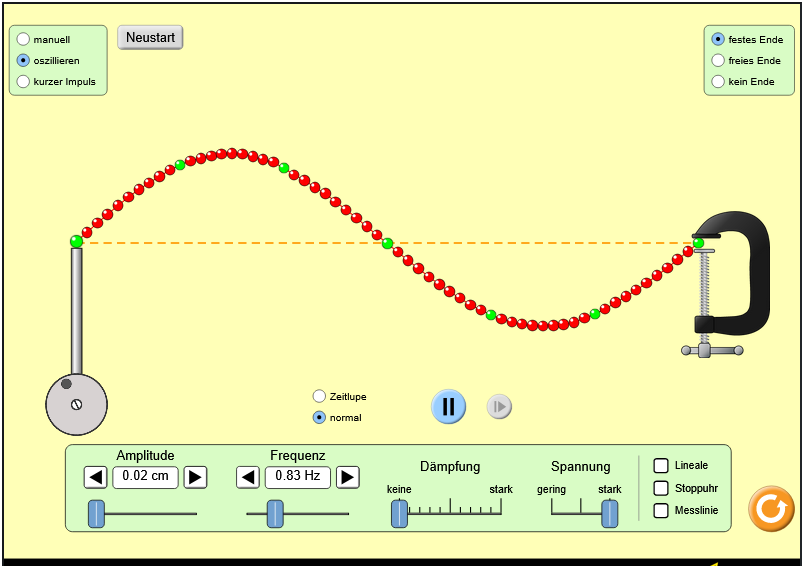

# Wellen 2

## Interferenzen

B, Blyat

## Simulation

### Geltungsreich und Voraussetzungen

* festes Ende
* Stehende welle

## A

Sie werden gespiegelt reflektiert. Wellentäler werden dabei zu Bergen und vice versa.

## B

Frequenz 0.83hz.

