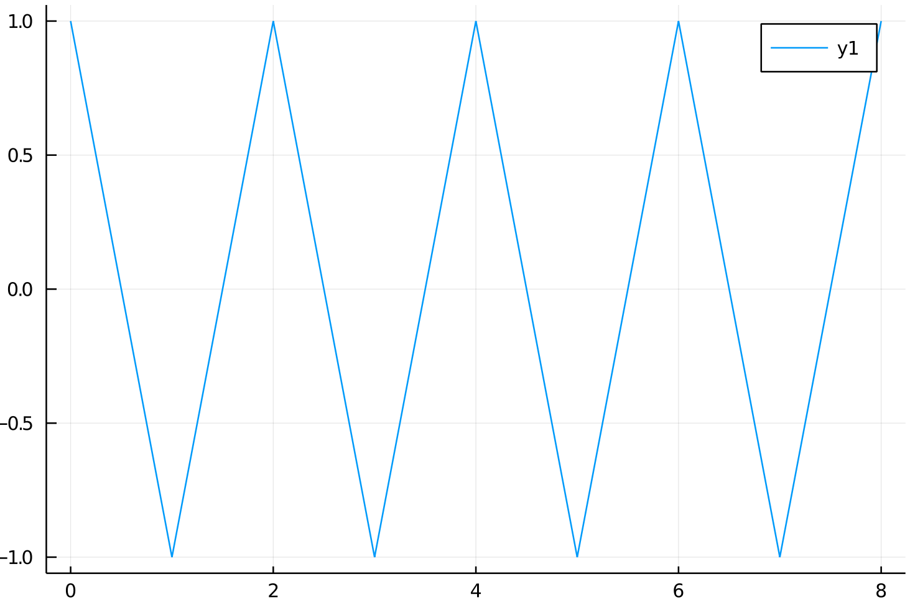
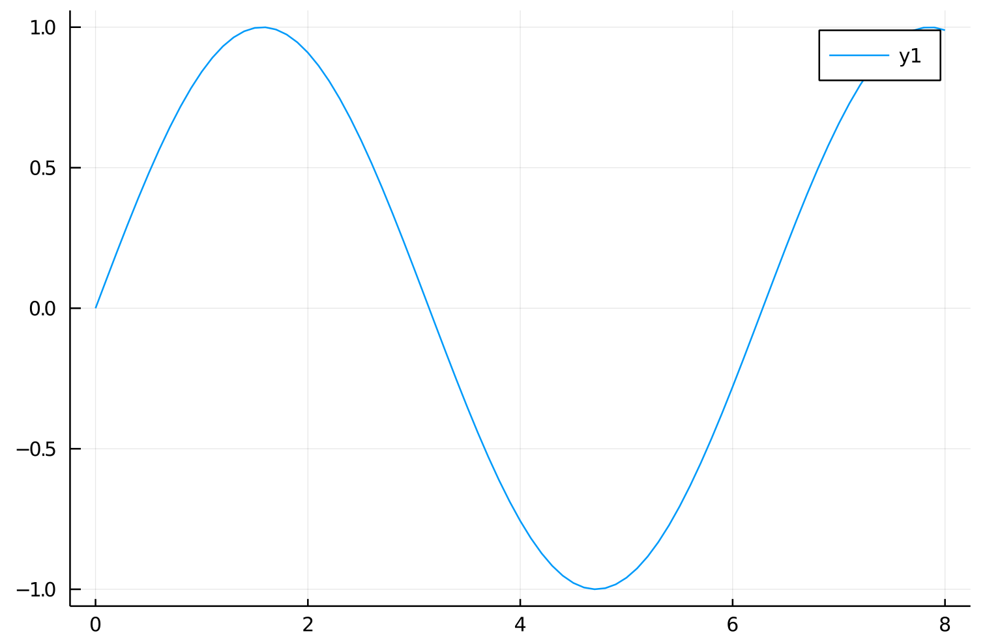
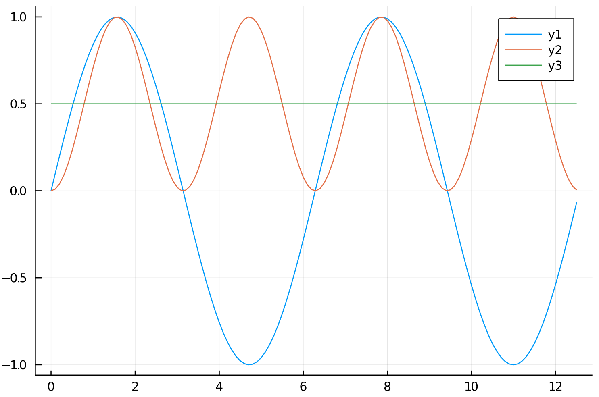

# Exkurs Wechselstrom

## Wechselgröße

* Periodisch
* zeitlicher Mittelwert = 0

Beispiel: Sinus, Saw

Dabei gilt Physik ... wer hätte es gedacht.

$u(t) = \hat{u} \cdot sin(\omega t + \phi_0)$

$u(t) = 325V \cdot sin(2\pi \cdot 50hz \cdot t)$

$u(t) = 325V \cdot sin(2\pi \cdot 50hz \cdot 2 \cdot 10^{-3}) = 191V$

$u(t) = 325V \cdot sin(2\pi \cdot 50hz \cdot 5 \cdot 10^{-3}) = 325V$

$u(t) = 325V \cdot sin(2\pi \cdot 50hz \cdot 10 \cdot 10^{-3}) = 0$

## Effektivwert

| Normalstrom          | Wechselstrom         |
| -------------------- | -------------------- |
| $P = U \cdot I$      | $p = u \cdot i$      |
| $I = \dfrac{U}{R}$   | $i = \dfrac{u}{r}$   |
| $P = \dfrac{U^2}{R}$ | $p = \dfrac{u^2}{r}$ |

